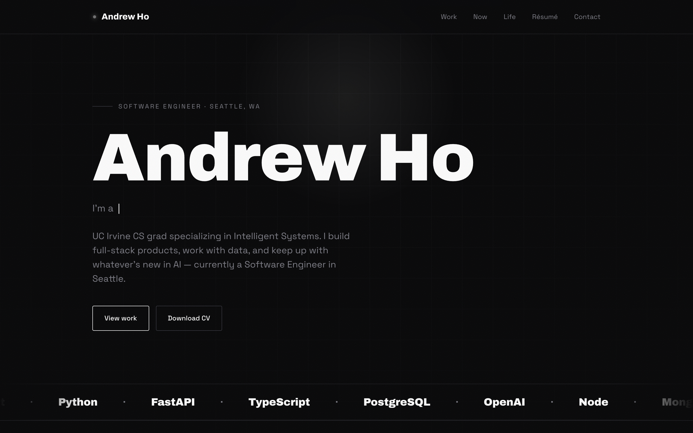

<h2 align="center">
  Andrew Ho — Portfolio<br/>
  <a href="https://andrewzho.dev/" target="_blank">andrewzho.dev</a>
</h2>

<div align="center">
  
</div>

<br/>

<p align="center">
  My personal portfolio — a dark, minimal, single-page site with a few subtle
  touches of motion (cursor spotlight, drifting grid, scroll reveals, tilt cards).
</p>

<p align="center">
  <a href="https://github.com/andrewzho/andrewzho.github.io/issues">Report Bug</a>
  &nbsp;·&nbsp;
  <a href="https://github.com/andrewzho/andrewzho.github.io/issues">Request Feature</a>
</p>

## Tech Stack

- **React 17** (Create React App)
- **React Router v6** — Home (single-page scroll) + a Résumé route
- **typewriter-effect** — rotating role line in the hero
- **react-pdf** — renders the résumé PDF inline (`src/Assets/Resume.pdf`)
- **Custom CSS** design system (`src/style.css`) — no UI framework; the look is
  hand-rolled (Archivo + Space Grotesk, monochrome OLED palette)
- **GitHub Pages** — hosting, deployed via `gh-pages`

## Run Locally

```bash
git clone https://github.com/andrewzho/andrewzho.github.io.git
cd andrewzho.github.io
npm install
npm start          # dev server at http://localhost:3000
```

## Build & Deploy

Hosted on **Vercel** — every push to `main` triggers an automatic production
deploy (framework preset: Create React App). SPA routing is handled by
`vercel.json`, so no manual step is needed.

```bash
npm run build      # local production build into /build
```

GitHub Pages remains available as a fallback:

```bash
npm run deploy     # build + publish to the gh-pages branch
```

`npm run deploy` runs the `predeploy` step first, which builds the app and copies
`build/index.html` to `build/404.html`. This is what lets GitHub Pages serve the
single-page app correctly when someone navigates directly to a client-side route
(e.g. `/resume`) — Pages returns the 404 page, which is really the app, and React
Router takes over from there.

## Structure

```
src/
├── App.js                    # routes (/ and /resume) + global layers
├── style.css                 # the whole design system
├── components/
│   ├── Ambient.js            # cursor spotlight, drifting grid, grain, scroll-reveal
│   ├── Navbar.js             # sticky nav with section scrolling
│   ├── Footer.js             # "Let's talk" contact section
│   ├── Home/                 # single-page scroll: hero, work, currently, life
│   └── Resume/               # inline PDF viewer + download
└── Assets/                   # Resume.pdf, favicon, etc.
```

## Credit

Originally bootstrapped from [Soumyajit4419's Portfolio](https://github.com/soumyajit4419/Portfolio);
the current design and content are my own.
